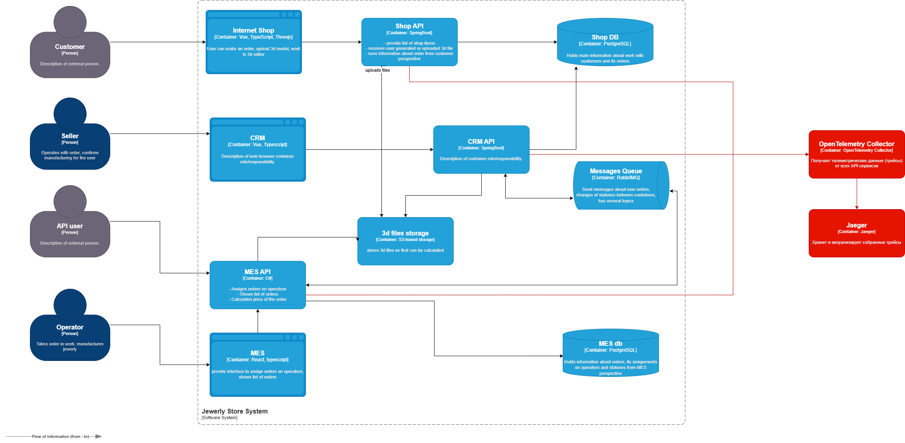
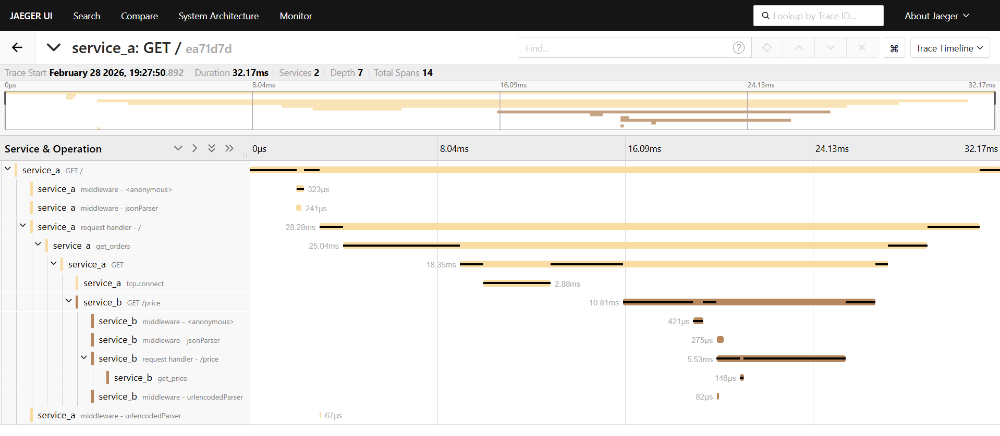

# Архитектурное решение по трейсингу

**Места, где заказ может «сломаться» или зависнуть:**
1. Онлайн-магазин:
    - Создание заказа без дальнейшей передачи.
    - Ошибка при отправке запроса в CRM или в очередь.
    - Тайм-аут при обработке 3D-модели.

2. RabbitMQ:
    - Потеря сообщений после публикации.
    - Зависание сообщений в очереди.

3. CRM:
    - Заказ создан частично.
    - Обновление статуса в БД без отправки события.
    - Ошибка при подтверждении заказа.

4. MES:
    - Зависание расчета стоимости.
    - Ошибка при смене статуса заказа.
    - Некорректное сохранение статуса после действий оператора.

5. Интеграция с B2B API:
    - Потеря заказов от партнеров.
    - Ответ партнеру не вернулся.
    - Создание дубликатов при повторных отправках.

**Список данных, которые должны попадать в трейсинг:**
- trace_id — уникальный идентификатор цепочки вызовов.
- span_id — идентификатор отдельного этапа.
- order_id — идентификатор заказа.
- Имя сервиса.
- Вызванный endpoint.
- Имя очереди.
- Время начала и окончания операции.
- Длительность операции.
- Статус операции (success/error).
- Текст ошибки.
- Текущий статус заказа.

## Мотивация
**Текущие проблемы:**
- Потеря заказов на неизвестных этапах.
- Жалобы клиентов появляются раньше, чем обнаруживается проблема.
- Поиск причины занимает много времени.
- Некоторые проблемы невоспроизводимы, диагностика затрудняется.
- Нет единой картины прохождения заказа через все компоненты системы.

**Бизнес-ценность трейсинга:**
- Позволяет быстро локализовать этап, на котором заказ завис или был потерян.
- Сокращает время расследования инцидентов.
- Уменьшает количество потерянных заказов.
- Повышает доверие B2B-партнеров.
- Обеспечивает контроль выполнения SLA.

**Технические метрики**
- Среднее время прохождения заказа от SUBMITTED до CLOSED.
- Время выполнения расчета стоимости.
- Количество зависших заказов за период.
- Количество ошибок на каждом сервисе.
- Среднее время восстановления (MTTR) при инцидентах.

**Бизнес-метрики**
- Доля заказов, выполненных в установленный срок.
- Количество жалоб.
- Количество потерянных заказов.
- Удержание B2B-партнеров.
- Количество инцидентов, влияющих на SLA.

## Предлагаемое решение
**Технологии для реализации трейсинга:**
- OpenTelemetry (OTel) — сбор телеметрии из сервисов.
- Jaeger — хранение и визуализация трейсов.

**План внедрения и доработки компонентов для реализации трейсинга:**
1. Внедрить OpenTelemetry SDK в сервисы Shop API, CRM API и MES API.
2. Настроить передачу контекста трейсинга через HTTP-заголовки и заголовки сообщений RabbitMQ.
3. Развернуть Jaeger и Jaeger UI.
4. Добавить автоматическую привязку трейса к order_id, чтобы можно было искать заказ по номеру.
 
[Диаграмма контейнеров «Александрит»](jewerly_c4_model.drawio)

## Компромиссы
- Сложно заставить проприетарную систему отдавать метрики в нужном формате, может потребоваться доработка.
- Дополнительная нагрузка на сервисы, может понадобиться масштабирование.
- Требуется место для хранения данных.
- Трейсинг не устраняет ошибки, а лишь ускоряет их обнаружение и анализ.

## Аспекты безопасности
- Внедрение аутентификации — зайти в систему смогут только сотрудники компании с актуальной учетной записью и ролью "Поддержка".
- Доступ к Jaeger предоставляется только через внутреннюю сеть или корпоративный VPN.
- Персональные данные не передаются в трейсинг.
- Все действия пользователей в Jaeger UI логируются.

## Трейсинг с OpenTelemetry и Jaeger
