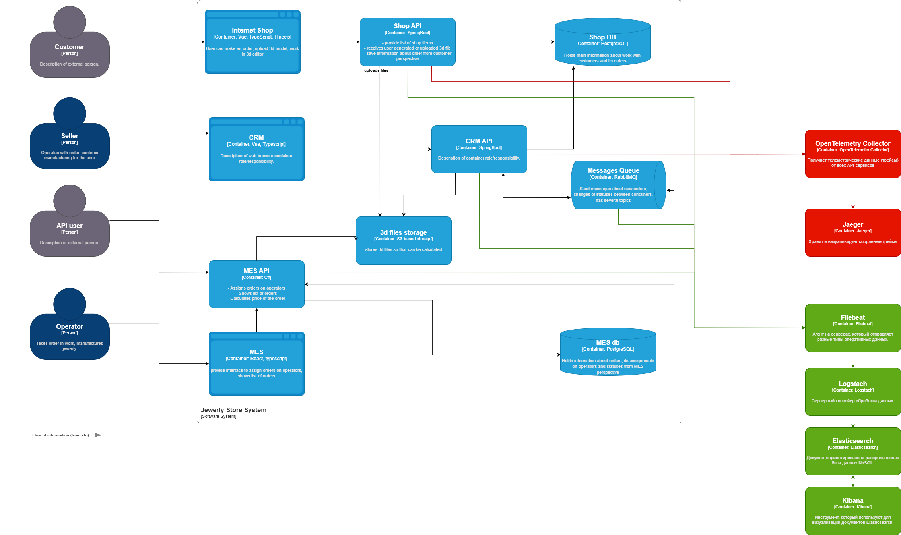

# Архитектурное решение по логированию

**Необходимые логи с уровнем INFO:**
- Создание заказа: время, идентификатор покупателя, номер заказа, сумма.
- Изменение статуса заказа: время, ID заказа, старый и новый статусы.
- Запросы к API: время, метод, URL, параметры запроса, статус ответа.
- Ошибки внешних сервисов: время, название сервиса, код ответа, описание ошибки.
- Авторизация пользователей: время, ID пользователя, тип операции (вход, выход), успешность.
- Системные события: время, перезапуск сервиса, обновление конфигурации, масштабирование подов.

**Другие уровни логирования:**
- WARN — нестандартные ситуации, требующие внимания (например, превышение среднего времени ответа API).
- ERROR — ошибки, при которых не удалось выполнить операцию (например, не удалось создать заказ, ошибка при оплате).
- DEBUG — подробная информация для разработчиков, включается по необходимости для диагностики проблем.

## Мотивация
**Текущие проблемы:**
- Поддержка разбирается после жалоб клиентов, приходится тратить время на поиск причины ошибок.
- Сложно отслеживать нагрузку на сервисы и понимать, где узкие места.
- Нет единого источника данных для анализа инцидентов и трендов.

**Бизнес-ценность логирования:**
- Быстрое выявление и исправление ошибок, меньше жалоб от клиентов.
- Контроль бизнес-процессов: можно отслеживать успешность оплаты, создание заказов и т. д.
- Улучшение качества сервиса за счет анализа аномалий и узких мест.
- Возможность автоматического уведомления при критических проблемах.

**Технические метрики**
- Среднее время отклика API.
- Количество ошибок на единицу времени.
- Количество обработанных заказов за день.
- Время выполнения ключевых бизнес-процессов.

**Бизнес-метрики**
- Количество успешных заказов.
- Количество отказов из-за системных ошибок.
- Время реакции на инциденты службы поддержки.
- Конверсия покупок.

**Приоритетность:**
В первую очередь необходимо внедрить логирование в следующие системы:
1. Shop API, CRM API и MES API — ключевые бизнес‑операции, поэтому важно отслеживать действия покупателей, продавцов и операторов.

2. Messages Queue (RabbitMQ) — отказ очереди или потеря сообщений могут привести к рассинхронизации состояния между сервисами.

## Предлагаемое решение
**Технологии для реализации логирования:**
- Filebeat — агент на серверах, который отправляет разные типы оперативных данных. Передаёт данные в Logstach.
- Logstash — собирает входные данные. Передаёт данные в Elasticsearch.
- Elasticsearch — документоориентированная распределённая база данных NoSQL для хранения и поиска логов. Обменивается данными с Kibana.
- Kibana — инструмент для визуализации и анализа логов из Elasticsearch.

[Диаграмма контейнеров «Александрит»](Task4_jewerly_c4_model.drawio)

**План внедрения и доработки компонентов для реализации логирования:**
1. Внедрить структурированное логирование (формат JSON) во всех сервисах.
2. Добавить единый формат логов.
3. Развернуть стек ELK (Elasticsearch + Logstash + Kibana), также используя Filebeat.
4. Настроить передачу логов из контейнеров в Logstash.
5. Создать базовые дашборды в Kibana для мониторинга API, ошибок и бизнес-событий.
6. Настроить алертинг на критические события (ERROR выше порога, всплеск 5xx и т.д.).
7. Постепенно расширять покрытие логированием наиболее критичных сервисов.
 
**Политика безопасности:**
- Исключить логирование чувствительных данных (пароли, токены, платежные реквизиты).
- Маскирование персональных данных (например, частичное скрытие номера карты).
- Разграничение доступа к логам через RBAC.
- Доступ к Kibana только через защищённый канал (HTTPS + авторизация).
- Аудит доступа к логам.

**Политика хранения:**
- Разделение индексов по сервисам или по типам логов.
- Хранение логов минимум 30 дней.
- Автоматическое удаление устаревших логов.

**Мероприятия для превращения системы сбора логов в систему анализа логов:**
- Настройка алертинга при превышении пороговых значений (рост ошибок, увеличение времени ответа).
- Настройка уведомлений в Slack / Email при критических сбоях.
- Поиск аномалий (например, резкий рост количества заказов или запросов — возможный DDoS).
- Построение аналитических дашбордов для бизнес- и технических метрик.
- Корреляция логов с трассировками для ускорения расследования инцидентов.